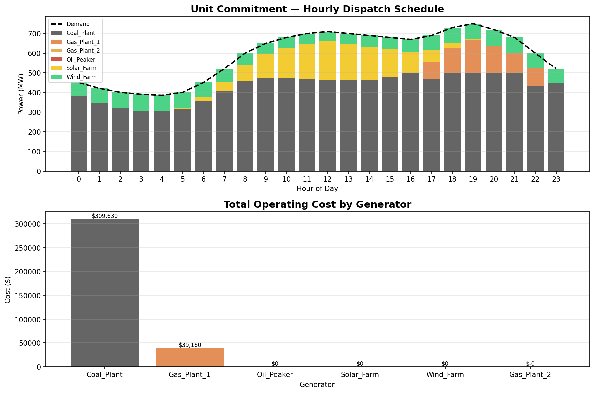
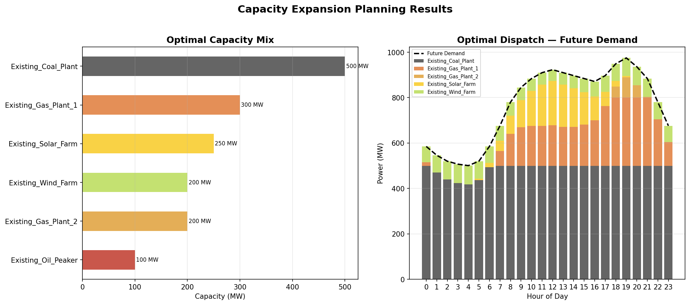

# ⚡ Power Systems Optimization

A Python-based power systems optimization project that models **Unit Commitment** and **Capacity Expansion Planning** problems using **Mixed-Integer Linear Programming (MILP)**.

Built with [PyPSA](https://pypsa.org/) and the [HiGHS](https://highs.dev/) open-source solver.

---

## 🎯 About This Project

This project was developed to understand how power grid operators make real-time and long-term decisions. I built both models from scratch using PyPSA to explore how MILP optimization drives generator scheduling and investment planning in modern energy systems.

The unit commitment model simulates a 24-hour dispatch schedule across 6 generator types, while the capacity expansion model evaluates whether new solar, wind, gas, or battery storage investments are economically justified under a 30% demand growth scenario.

---

## 📌 Project Overview

Modern power grids face two fundamental optimization problems:

| Problem | Question | Time Horizon |
|---|---|---|
| **Unit Commitment** | Which generators should run each hour to meet demand at minimum cost? | Short-term (hours) |
| **Capacity Expansion** | What new power plants should be built to meet future demand at minimum cost? | Long-term (years) |

Both are solved as MILP problems where binary variables represent on/off decisions for generators and continuous variables represent power output levels.

---

## 🗂️ Project Structure

```
power-systems-optimization/
│
├── data/
│   ├── generators.csv         # Generator specs (capacity, cost, constraints)
│   ├── demand.csv             # 24-hour electricity demand profile
│   └── capacity_factors.csv   # Hourly solar & wind availability
│
├── models/
│   ├── unit_commitment.py     # Short-term scheduling model
│   └── capacity_expansion.py  # Long-term investment planning model
│
├── results/
│   ├── uc_dispatch.csv              # Unit commitment dispatch results
│   ├── uc_dispatch_chart.png        # Dispatch visualization
│   ├── expansion_investments.csv    # Optimal investment decisions
│   ├── expansion_dispatch.csv       # Expansion model dispatch
│   └── expansion_plan_chart.png     # Capacity mix visualization
│
├── requirements.txt
└── README.md
```

---

## ⚙️ Installation

**Requirements:** Python 3.9+

```bash
# Clone the repository
git clone https://github.com/Ritagya09/power-systems-optimization.git
cd power-systems-optimization

# Install dependencies
pip install -r requirements.txt
```

---

## 🚀 Usage

### Run Unit Commitment Model
```bash
python3 models/unit_commitment.py
```
Outputs:
- Console: hourly dispatch table + total system cost
- `results/uc_dispatch.csv` — dispatch schedule per generator
- `results/uc_dispatch_chart.png` — stacked dispatch chart

### Run Capacity Expansion Model
```bash
python3 models/capacity_expansion.py
```
Outputs:
- Console: optimal investment decisions (MW to build per technology)
- `results/expansion_investments.csv` — investment plan
- `results/expansion_plan_chart.png` — capacity mix + dispatch chart

---

## 📊 Results

### Unit Commitment
The model schedules 6 generators over 24 hours to meet demand (390–750 MW):

- **Coal** runs as baseload (cheapest marginal cost at $30/MWh)
- **Solar & Wind** are always used when available (zero marginal cost)
- **Gas** fills peak demand hours
- **Oil Peaker** dispatched only at highest demand hours (most expensive at $90/MWh)



### Capacity Expansion
The model evaluates whether to invest in new Solar, Wind, Gas, or Battery storage to meet 30% demand growth:

- Existing fleet (1,550 MW total) is sufficient to meet projected demand
- No new investment required at current demand growth assumptions
- System approaches capacity limits at peak — further demand growth would trigger new solar/wind investment



---

## 🧮 MILP Formulation

### Unit Commitment
**Objective:** Minimize total operating cost

$$\min \sum_{t} \sum_{g} (c_g \cdot p_{g,t} + s_g \cdot u_{g,t})$$

**Subject to:**
- Power balance: $\sum_g p_{g,t} = d_t \quad \forall t$
- Capacity limits: $u_{g,t} \cdot P_g^{min} \leq p_{g,t} \leq u_{g,t} \cdot P_g^{max}$
- Binary commitment: $u_{g,t} \in \{0, 1\}$

### Capacity Expansion
**Objective:** Minimize total annual cost (capital + operating)

$$\min \sum_{g} (a_g \cdot \hat{p}_g) + \sum_{t} \sum_{g} c_g \cdot p_{g,t}$$

**Subject to:**
- Power balance every hour
- $0 \leq \hat{p}_g \leq P_g^{max}$ (investment decision)
- $p_{g,t} \leq \hat{p}_g$ (can't dispatch more than built)

Where $a_g$ is the annualized capital cost using Capital Recovery Factor (CRF).

---

## 💡 Key Learnings

- How MILP binary variables model generator on/off decisions — a plant can't run at 10% capacity, it's either on or off
- Why coal runs as baseload (lowest marginal cost at $30/MWh) while oil peakers are last resort ($90/MWh)
- How annualized CAPEX using the Capital Recovery Factor lets us fairly compare one-time build costs against annual operating costs
- How renewable capacity factors (solar peaking at 0.78 midday, wind steadier at 0.25–0.42) directly shape the dispatch schedule
- Why the optimizer avoids new investment when existing capacity is sufficient — capital costs only make sense if they reduce operating costs enough to justify them

---

## 🛠️ Tools & Libraries

| Tool | Purpose |
|---|---|
| [PyPSA](https://pypsa.org/) | Power system network modeling and optimization |
| [HiGHS](https://highs.dev/) | Open-source MILP/LP solver |
| [linopy](https://linopy.readthedocs.io/) | Linear optimization model builder (used by PyPSA) |
| [pandas](https://pandas.pydata.org/) | Data manipulation |
| [matplotlib](https://matplotlib.org/) | Visualization |

---

## 📚 References

- [PyPSA Documentation](https://pypsa.readthedocs.io/)
- [HiGHS Solver](https://highs.dev/)
- Morales, J.M. et al. *Integrating Renewables in Electricity Markets* (2014)
- Kirschen, D. & Strbac, G. *Fundamentals of Power System Economics* (2018)

---

## 👩‍💻 Author

**Ritagya Chitkara**
Electrical Engineering student interested in power systems and energy optimization.
- GitHub: [@Ritagya09](https://github.com/Ritagya09)

---

## 📄 License

This project is open source and available under the [MIT License](LICENSE).
